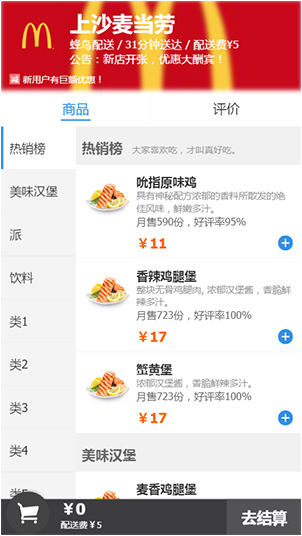

# myEle

使用vue2 等相关工具模仿饿了么前端页面，有登录，购物车，查看订单，浏览商品等功能。


网页是有假的账户密码的部分页面需要登录 ↓ ，最好在Chrome手机模式下浏览。
username：admin 
password：12345
导航部分使用 Vue-swipe 插件，[https://github.com/ElemeFE/vue-swipe](https://github.com/ElemeFE/vue-swipe)
### 本地预览步骤

```
# clone 文件
git clone https://github.com/xqqaixuexi/myEle.git

# 进入 myEle 文件夹
cd myEle

# install dependencies
npm install

# 运行 npm run dev 会在浏览器打开 localhost:8080
npm run dev
```


> 使用到的相关库或工具：vue2 + vuex2 + vue-router2 + vue-swipe + vue-cli

<p align="center">
  
</p>
<p align="center">
  
</p>
<p align="center">
  
</p>


商家列表部分，因为数据是伪造的，只有五个商家数据。

######business.vue（商家详情页）

```
// 部分代码
export default {
  computed: {
    // 通过id找到store中对应店铺信息
    business_info () {
      return this.$store.getters.getFalseBussinessInfo[this.$route.params.id];
    }
  },
  methods: {
    // 右列表控制左列表样式
    rightControlLeftClass () {
       // code
    },
    // 左列表点击控制右列表滚动
    leftControlRightScroll (index) {
       // code
    },
    // 监控网页的resize来改变商品列表的高度
    watchHei () {
       // code
    },
    // 列表中的加按钮点击
    add_food (n, x, e) { // n 为大类 x为大类种商品
       // code
    },
    // 向购物车添加
    add_shopping_car (type, typename, foodname, foodid, foodprice) {
      if (!this.shoppingCarList[foodid]) {
        this.shoppingCarList[foodid] = {
          'type_accumulation': type,
          'type_name': typename,
          'name': foodname,
          'one_food_id': foodid,
          'unit_price': foodprice,
          'count': 1
        };
      } else {
        this.shoppingCarList[foodid].count++;
      }
      // 购物车改变 相关计算
      this.spChangeComputeAll();
    },
    // 购物车改变 相关计算
    spChangeComputeAll () {
       // code
    },
    // 结账
    checkout () {
       // code
    },

  }
};
```
```
商家详情页占一整屏，最外层不允许出现滚动条，分上下两部分，上半部分给固定rem高度，下半部分高度动态计算，屏幕大小改变再次计算，下半部分，左右各一个ul列表，设置高度100%，overflow-y:auto;超出即可滚动。

左右列表
右ul滚动监控所有标题行的offsetTop，对比当前ul的scrollTop，给左ul添加对应样式。点击左列表，来控制右列表滚动。

购物车
data中定义一个购物车对象{ }，添加某样商品时，已存在就+1，不存在则添加属性，每次添加计算总价等相关数据。

添加商品的抛球效果
每次添加获得点击按钮的坐标与目标位置的坐标，算得高度差值，用到了css3贝塞尔曲线。

结算
结算时将当前购物车中计算出的简略信息添加到state中，清空购物车，跳转路由。 
```


